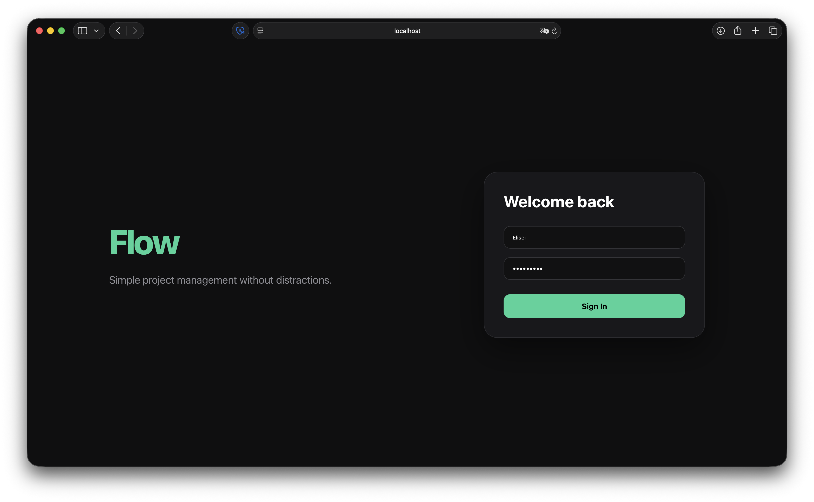
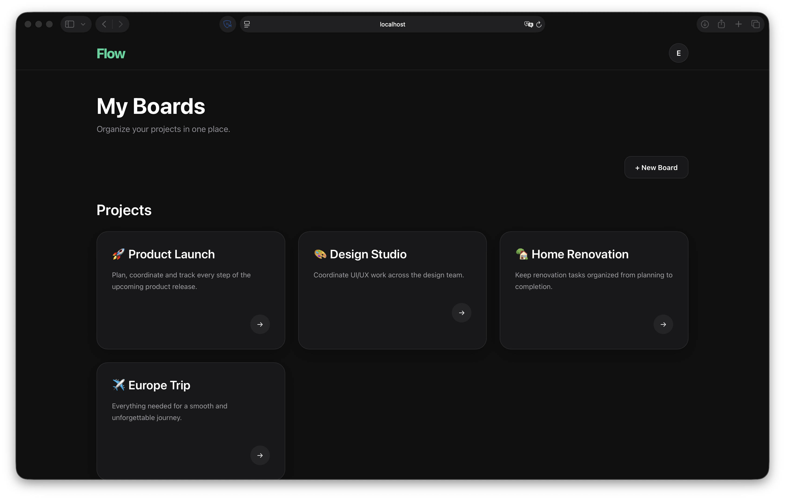
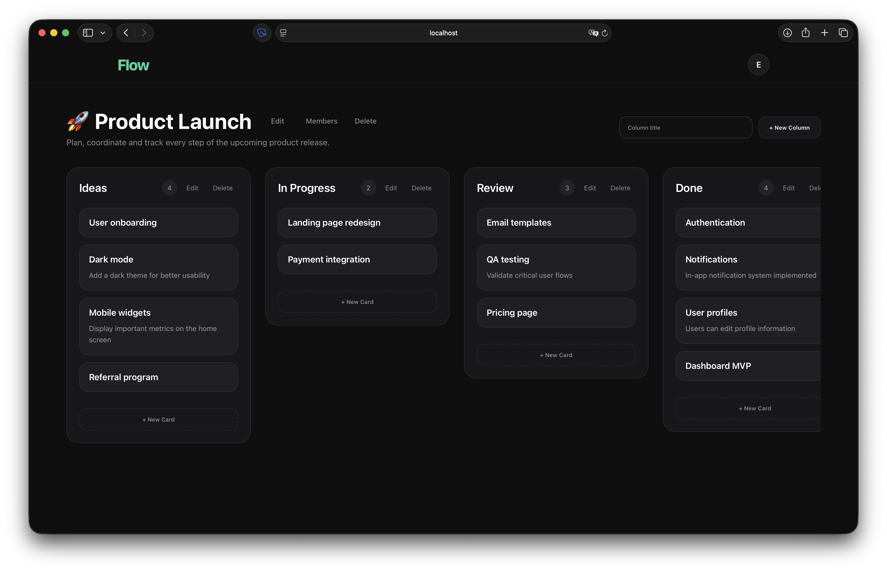
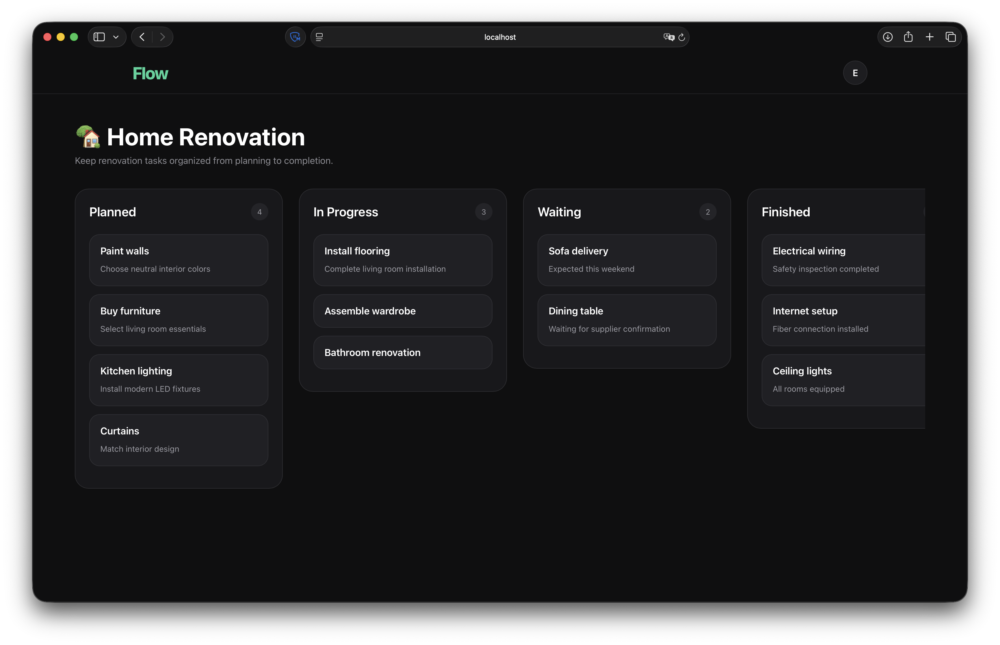
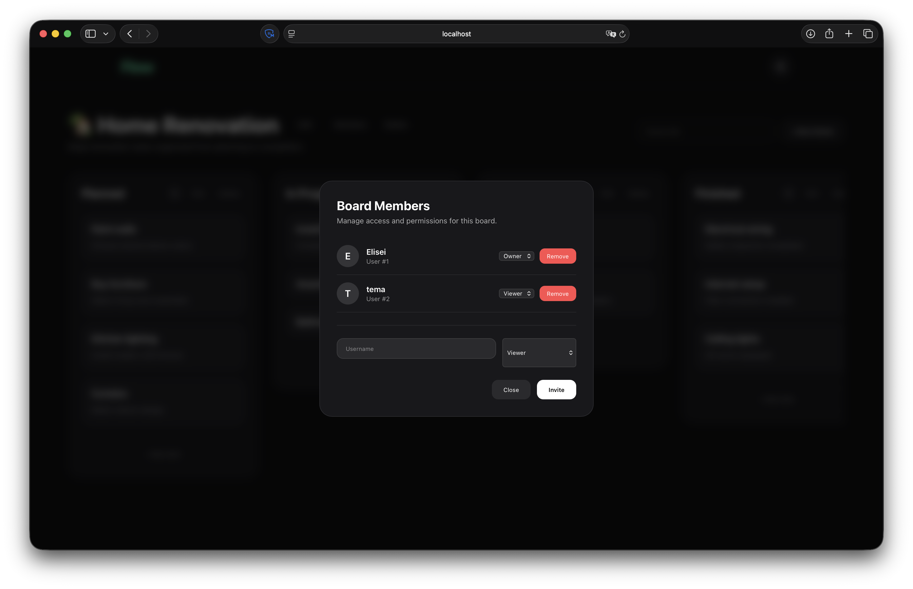

<div align="center">

# 🚀 Kanban Board

### Modern task management system built with FastAPI & React

Учебный проект по разработке полноценного Kanban-сервиса с поддержкой совместной работы и разграничением прав доступа.

<br>


</div>

---

# 🇷🇺 Русский

## 📌 О проекте

Kanban Board — современное веб-приложение для управления задачами по методологии Kanban.

Проект разработан в рамках учебной практики и представляет собой полноценную систему управления задачами с поддержкой нескольких пользователей, совместной работы и разграничением прав доступа.

---

# ✨ Возможности

## 👤 Пользователи

- Регистрация
- Авторизация (JWT)
- Защищённые API

## 📋 Доски

- Создание досок
- Редактирование
- Удаление
- Описание

## 📂 Колонки

- Создание
- Переименование
- Удаление

## ✅ Карточки

- Создание
- Редактирование
- Удаление
- Drag & Drop между колонками

## 👥 Совместная работа

- Добавление участников
- Изменение ролей
- Общие доски

---

# 🔐 Role Based Access Control (RBAC)

| Роль | Возможности |
|------|-------------|
| 👑 Owner | Полный доступ, управление участниками |
| ✏️ Editor | Работа с карточками и колонками |
| 👀 Viewer | Только просмотр |

Права проверяются одновременно:

- ✅ Backend
- ✅ Frontend

---

# 📷 Интерфейс приложения

## 🔐 Authentication

Регистрация и авторизация пользователей с использованием JWT-аутентификации.



---

## 📋 Boards Overview

Главная страница приложения со списком доступных Kanban-досок пользователя.



---

## 👑 Board View (Owner)

Интерфейс владельца доски с полным доступом к управлению доской, участниками, колонками и карточками.



---

## 👀 Board View (Viewer)

Интерфейс пользователя с ролью **Viewer**. Доступен только просмотр содержимого без возможности редактирования.



---

## 👥 Board Members Management

Управление участниками доски, назначение ролей (Owner, Editor, Viewer) и предоставление доступа.



---

# 🛠️ Стек технологий

### Frontend

- React
- TypeScript
- Vite

### Backend

- FastAPI
- SQLAlchemy
- PostgreSQL

### DevOps

- Docker

---

# 🏗 Архитектура

```
Frontend (React)

        │

      Axios

        │

Backend (FastAPI)

        │

 Service Layer

        │

 SQLAlchemy ORM

        │

 PostgreSQL
```

---

# 🗄️ Структура базы данных

```
User
│
├── owns
│       │
│       ▼
│     Board
│       │
│       ├───────────────┐
│       ▼               ▼
│   BoardColumn     BoardMember
│       │               │
│       ▼               ▼
│      Card          User
```

---

# 📂 Структура проекта

```
kanban-board/

├── backend/
│   ├── app/
│   │
│   ├── models/
│   ├── routers/
│   ├── services/
│   ├── schemas/
│   ├── database.py
│   ├── dependencies.py
│   └── main.py
│
├── frontend/
│   ├── src/
│   ├── api/
│   ├── components/
│   ├── pages/
│   ├── styles/
│   └── types/
│
└── docker-compose.yml
```

---

# 🚀 Запуск проекта

## Backend

```bash
cd backend

python -m venv .venv

source .venv/bin/activate

pip install -r requirements.txt

uvicorn app.main:app --reload
```

---

## Frontend

```bash
cd frontend

npm install

npm run dev
```

---

## PostgreSQL

```bash
docker compose up -d
```

---

# 📈 Реализовано

- JWT Authentication
- CRUD Boards
- CRUD Columns
- CRUD Cards
- Drag & Drop
- Role Based Access Control
- Shared Boards
- Member Management
- Responsive UI

---

# 🚀 Возможные улучшения

- 🔍 Поиск карточек
- 📎 Вложения
- 📝 Audit Log
- 🔔 Уведомления
- ⚡ WebSocket
- 📑 Шаблоны задач

---

# 🇬🇧 English

## About

Kanban Board is a modern task management web application built with FastAPI and React.

The project was developed as a university internship project and demonstrates a complete Kanban system with authentication, collaborative boards and Role-Based Access Control.

---

# 📷 Application Interface

## 🔐 Authentication

User registration and authentication using JWT-based authorization.


---

## 📋 Boards Overview

Main page displaying all Kanban boards available to the current user.


---

## 👑 Board View (Owner)

Board owner interface with full access to managing the board, members, columns, and cards.


---

## 👀 Board View (Viewer)

Board interface for users with the **Viewer** role. Read-only access without editing permissions.


---

## 👥 Board Members Management

Manage board members, assign roles (**Owner**, **Editor**, **Viewer**), and control access permissions.


---

## Features

- JWT Authentication
- Boards
- Columns
- Cards
- Drag & Drop
- Shared Boards
- RBAC
- Member Management

---

## Technology Stack

### Frontend

- React
- TypeScript
- Vite

### Backend

- FastAPI
- SQLAlchemy
- PostgreSQL

### DevOps

- Docker

---

## Architecture

```
React

↓

Axios

↓

FastAPI

↓

Service Layer

↓

SQLAlchemy

↓

PostgreSQL
```

---

## Future Improvements

- File Attachments
- Search
- Notifications
- Audit Log
- WebSockets
- Task Templates

---

<div align="center">

Made with ❤️ using FastAPI & React

</div>
